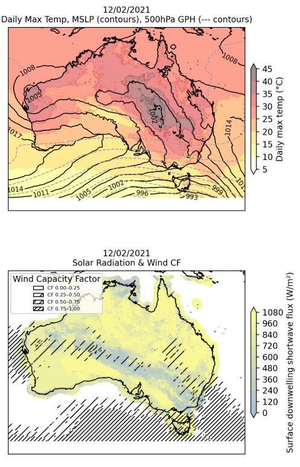

# Meteorology of hot and cloudy, high energy demand days in eastern Australia

A Centre of Excellence for 21st Century Weather project, investigating the meteorology of hot and cloudy events that are potentially relevant for energy system supply and demand. 

Manuscript in preparation.

<!--
Source - https://stackoverflow.com/a/14747656
Posted by Tieme, modified by community. See post 'Timeline' for change history
Retrieved 2026-04-01, License - CC BY-SA 4.0
-->

### Directory structure

* `notebooks` contains all jupyter notebooks used to produce figures used in the manuscript (in prep)
* `figs` provides final figures used in the manuscript (in prep)
* `data` contains a selection of datasets used to produce the manuscript (in prep), including a list of [Hot-Cloudy](data/event_times_csi0p5_thourly90.csv) and [Hot-Sunny](data/null_event_dates_csi0p5_thourly90_nhours7.csv) dates
* `modules` has a selection of scripts used for data processing
* `preliminary` has all preliminary notebooks and figures 

*Contributions from: Andrew Brown, Alex Dunne, Carl Doedens, Doug Richardson, Michael Barnes, Sanaa Hobeichi, Claire Vincent and Mehara Salpadoru*
